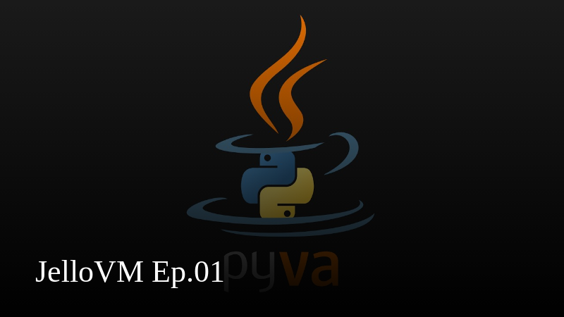

# JelloVM

JVM in Python that can only run ["Hello, World"](https://en.wikipedia.org/wiki/%22Hello,_World!%22_program).

## Quick Start

```console
$ javac Main.java
$ ./jello.py Main.class
```

## Screencasts

This was developed on a livestream:

[](https://www.youtube.com/watch?v=67FmRyv8jTM)
[](https://www.youtube.com/watch?v=anOidUQcv1w)

## References

- https://docs.oracle.com/javase/specs/jvms/se7/html/jvms-4.html
- https://docs.oracle.com/javase/specs/jvms/se7/html/jvms-6.html
